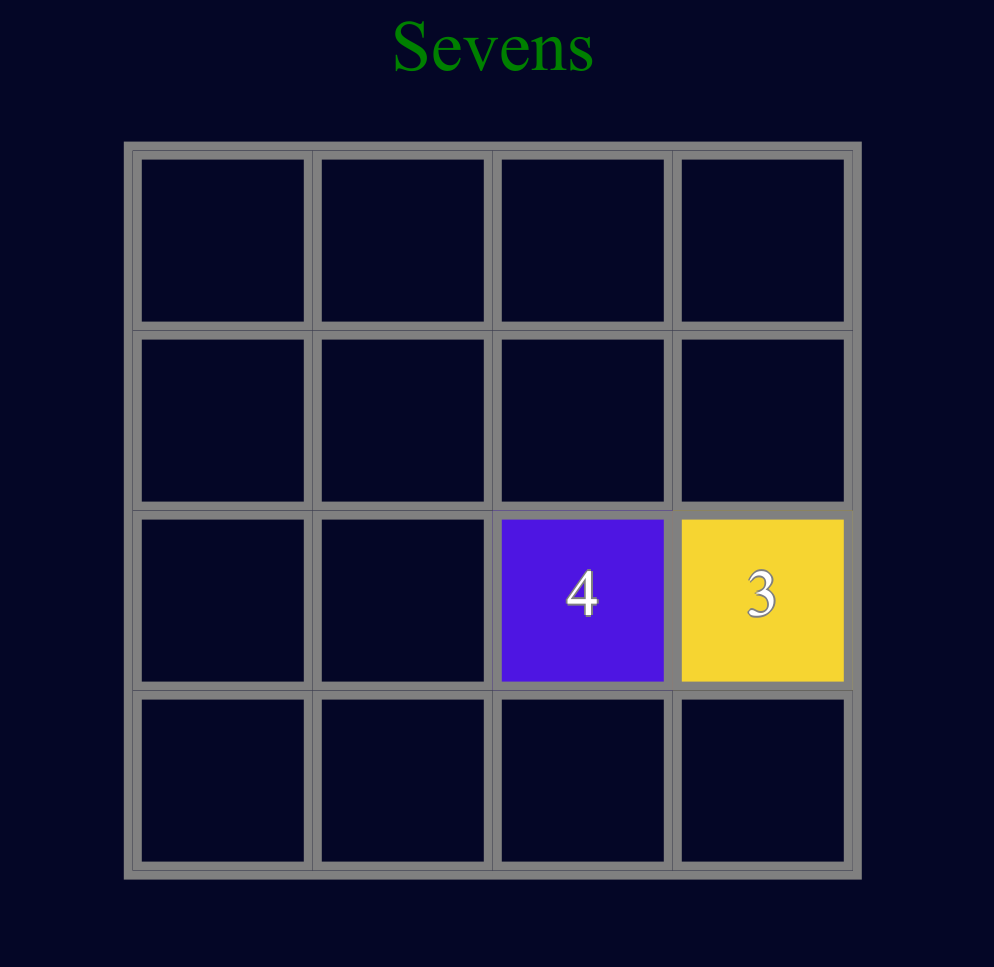

# Sevens
[Play now]

### How it was made
  - Display is DOM based
  - Used Materialize CSS for Game Over Modal
  - Used TouchSwipe-jQuery to allow control by swiping, and thus playable on mobile

The challenging aspect was dynamically rearranging the order in which tiles are processed after a move. Processing must begin on the far side of the move direction. For instance, if the user moves "up", the logic for processing tile movement must begin at the top row and work down. Whereas a right swipe necessitates processing the far right column first, and work left.

### About the Game

Sevens is a game based of [Threes], (another clone of which is 2048). The objective is simple prevent the board from filling up by merging tiles. The rules for merging are simple
  -  Threes can only pair with Fours
  -  Fours can only pair with Threes
  -  Tiles with a value of Seven or greater merge with tiles of the same value.

   [play now]: <jackmac92.github.io/Sevens/>
   [threes]: <http://asherv.com/threes/>
